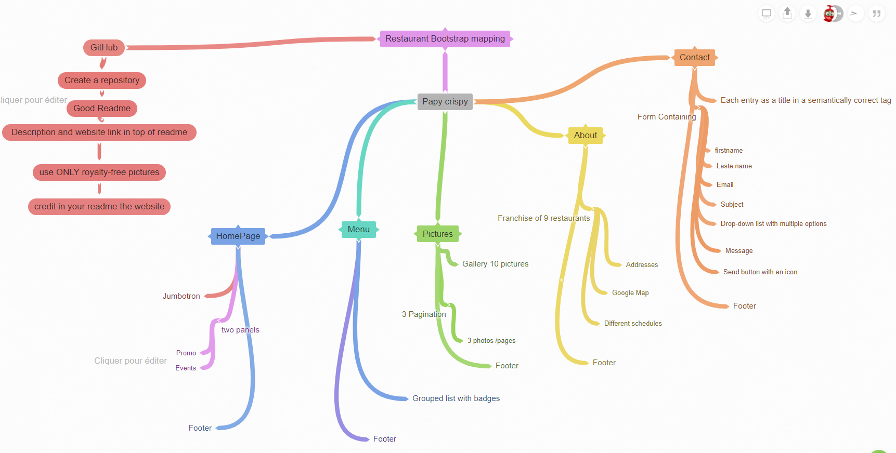
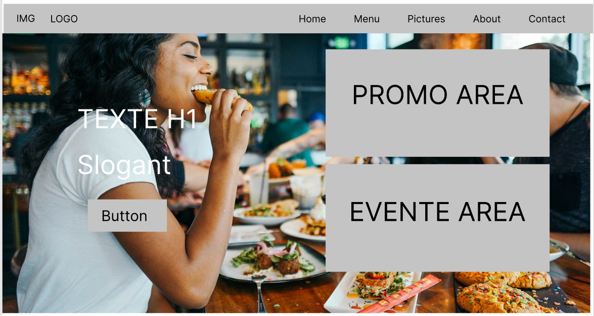
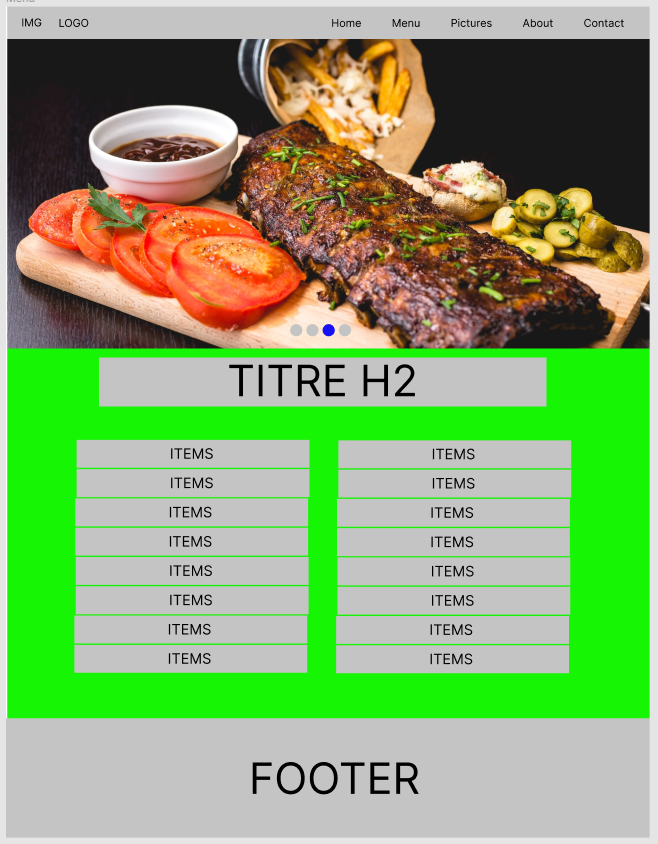
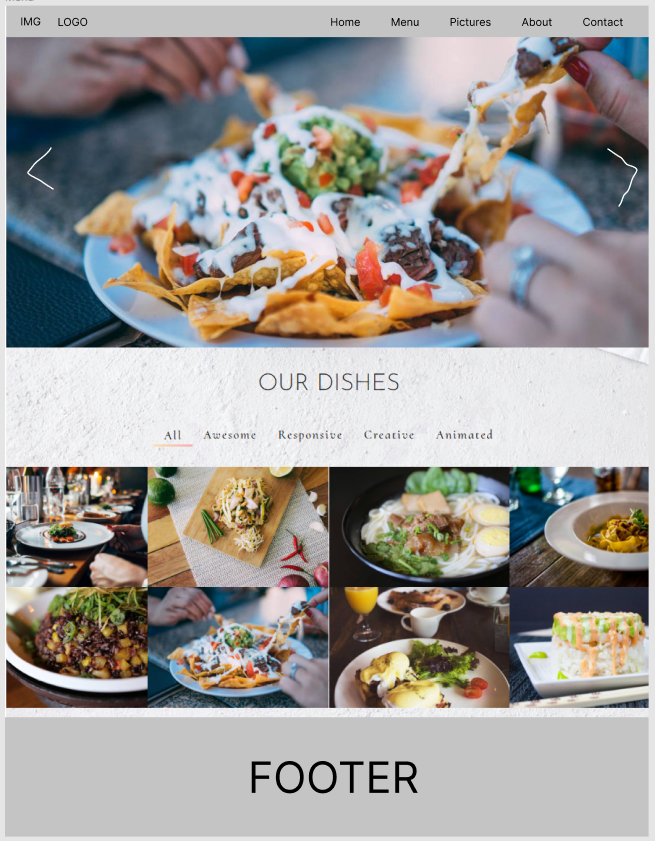
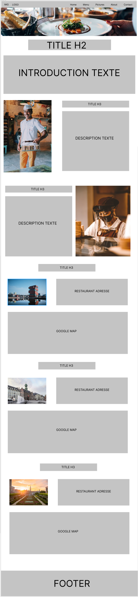
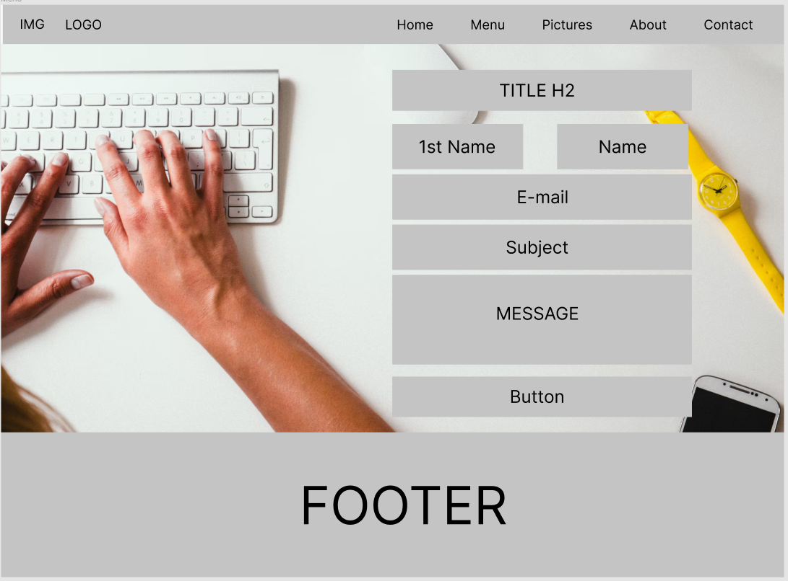

# Bootstrap-Restaurant

Website Restaurant with Bootstrap

## Presentation du projet

- Nom du projet : Restaurant Bootstrap
- Autreur : [Nordine Becode](https://github.com/ElazzouziNordineBeCode) - [Repository](https://github.com/ElazzouziNordineBeCode/Bootstrap-Restaurant) - [Site Online](https://elazzouzinordinebecode.github.io/Bootstrap-Restaurant/)
- Formation réaliser chez : [BeCode](https://becode.org/) à [BeCentral](https://becode.org/fr/a-propos-de-nous/nos-campus/bruxelles/) Bruxelles.
- Instructeur : [Mike](https://github.com/Mike00001)
- Credit : [Figma](https://www.figma.com/) - [Coggle](https://coggle.it/) - [Unspash](https://unsplash.com/)

## Pourquoi se Repository ?

Dans le cadre d'un exercice, fait au cours de ma formation pour devenir Fulle Stack Junior Developper, il nous a êtes demander d'exécuter plusieurs actions pour vérifier si on avait bien compris le fonctionnement de [bootstrap](https://getbootstrap.com/).

Pour cela, il a êtes demander de créer un site internet entierement fait avec Bootstrap est qui respecte certaine regles que voici :

## The mission (English)

- Create a repository called restaurant-css-framework in which you must realise a window web page for a restaurant. The franchise is fictive, but the type of food (burger, pizza, asian, …​) is your choice.

- The website must be responsive, at least for small and medium screens. It must at least have five accessible pages: welcome, menu, pictures, restaurants and contact.

- Welcome  
  A page with one Jumbotron and two panels to show news (promo, events, etc…​).

- Menu  
  A page with the restaurant menu in the form of a grouped list with badges.

- Pictures  
  A page with a gallery of minimum 10 pictures and a pagination (3 photos per page).

- Restaurant  
  A page about the restaurants (it’s a franchise) with its addresses, a map, and different schedules.

- Contact  
  A page with a contact form containing the firstname, lastname, email, subject of the message (a drop-down list with multiple options), an area for the message itself and a send button with an icon. Each entry as a title in a semantically correct tag.

If you want to make an even more complex website feel free to try new things and make it as beautiful as possible.

## Site map

J'ai utilisé le service en ligne [Coggle](https://coggle.it/) pour créer ce site map sur lequel j'ai essayé de reproduire un vison global du travail a faire en séparant chaque branche et en ajoutant chaque élément important qui doivent être sur chaque page.

## Details de chaque pages

Pour effectuer ses représentations de chaque page, j'ai utilisé le service en ligne [Figma](https://www.figma.com/).

### HomePage

### Menu

### Pictures

### About

### Contact

---

- Le code navbar recuperer chez [Start Bootstrap](https://startbootstrap.com/snippets/navbar-logo)
- Le code footer recuperer chez [MDBootstrap](https://mdbootstrap.com/snippets/standard/mdbootstrap/2886162)

Vous trouverez juste en haut (site Online) le résultat final.
